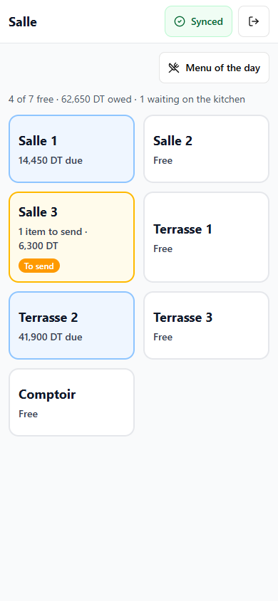
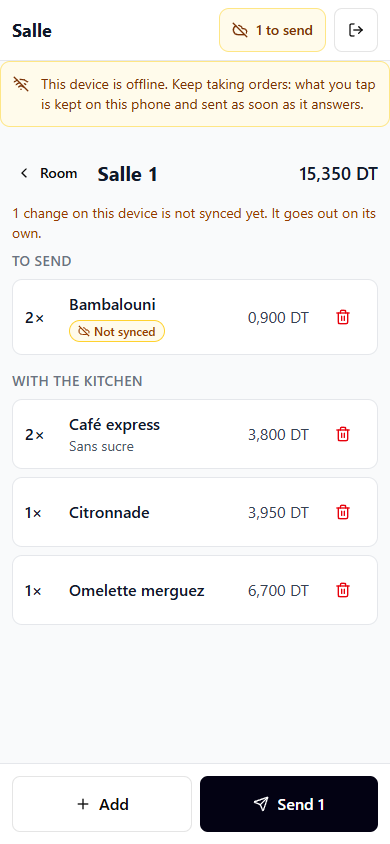
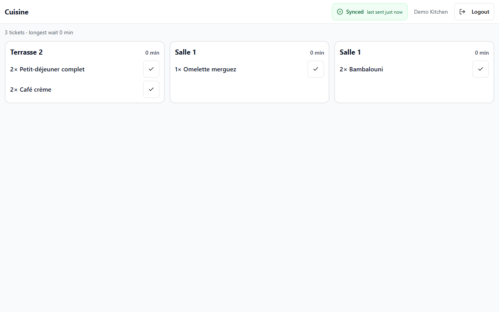
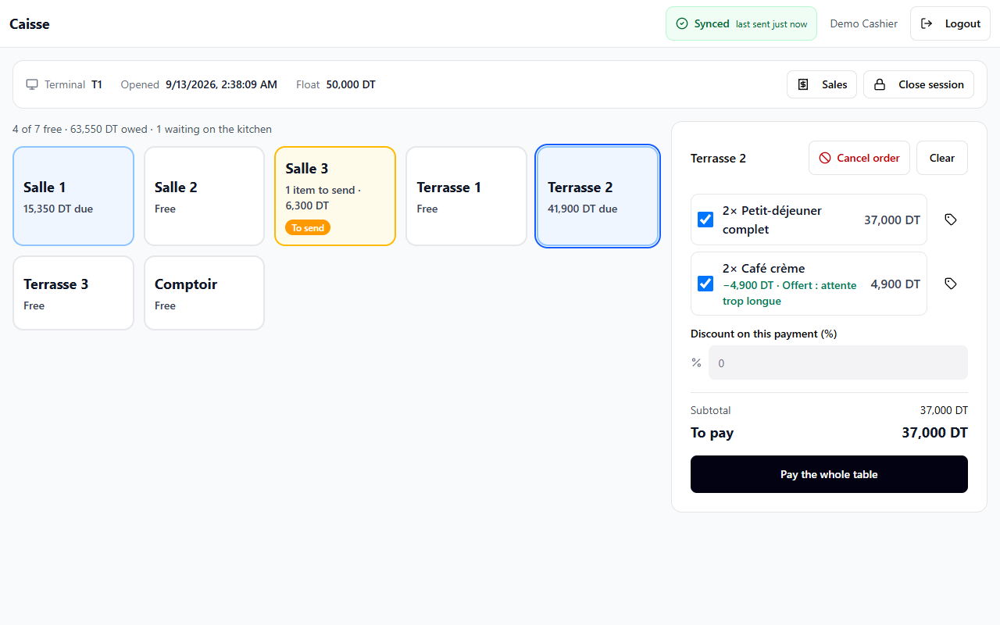
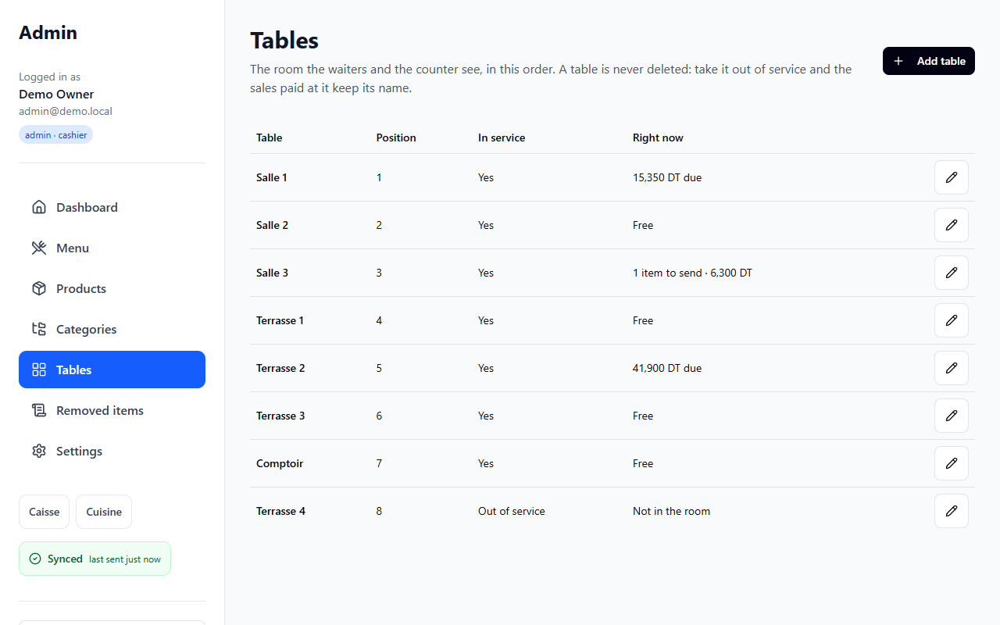
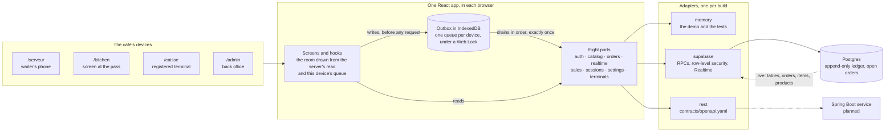
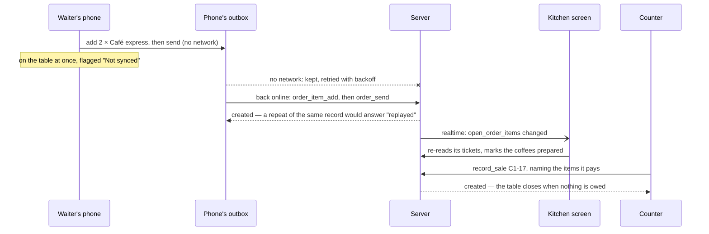

# pos-admin-dashboard

An offline-first point of sale for a Tunisian café, in one React app with four faces: the waiter's phone, the counter, the kitchen screen and the back office.

> **Status:** this started as a Figma Make export — a register screen and an admin dashboard over a key-value store — and is now the café the [spec](docs/spec.md) describes. Waiters keep taking orders and the counter keeps taking money when the network drops: every order and every payment is queued on the device and reaches the server exactly once, in order. Money is exact to the millime, receipts are numbered per terminal without gaps, and the sales ledger is append-only. The UI reaches its backend only through ports, so the same app runs on an in-browser demo, on Supabase, and on a REST adapter written against [contracts/openapi.yaml](contracts/openapi.yaml) for the service that will implement it.

## The four faces

| Face                 | Who opens it        | On                    | What happens there                                                                                                                                                                                                   |
| -------------------- | ------------------- | --------------------- | -------------------------------------------------------------------------------------------------------------------------------------------------------------------------------------------------------------------- |
| `/serveur` — Salle   | waiters             | a phone, mobile-first | The room as a grid of tables. Open a table, add from the menu with a note for the kitchen, send, take an item off with a reason, mark a dish sold out for the day.                                                   |
| `/kitchen` — Cuisine | the kitchen, admins | a screen at the pass  | One ticket per send, oldest first, live. Mark items prepared; an item taken off after it was sent stays on its ticket as a void, with the reason.                                                                    |
| `/caisse` — Caisse   | cashiers, admins    | a registered terminal | Open and close a cash session with a Z-report. Pay a whole table or the items ticked, discount or offer a line with a reason, take a percentage off, refund, and cancel a table's order while nothing on it is paid. |
| `/admin` — Admin     | admins              | a desktop             | Products and prices, the menu of the day, categories, the room's tables, the report of items removed after they were sent, the receipt footer, and registering this device as a terminal.                            |

A person can hold several roles — the owner is admin and cashier — and switches between their faces from the header. Every face carries the sync chip, which says whether what was done on this device has reached the server and leads to that face's Conflicts screen; only an admin can void a receipt there.

## Screenshots

<table>
  <tr>
    <td width="30%"></td>
    <td width="30%"></td>
    <td>
      <strong>The waiter's phone.</strong> The room, and a table whose next order was taken with no network: it is on the table at once, flagged, and goes out when the phone reconnects.
    </td>
  </tr>
</table>







## What it does differently

- **Offline-first.** Everything done during service — an item put on a table or taken off, a send, a dish marked prepared, an order cancelled, a payment or a refund, a session opened or closed — is a record written to IndexedDB before any request. One queue per device drains in the order records were written, one at a time, under a Web Lock, retrying without limit and stopping at the first record the server refuses. The screens draw that queue over the server's last read, so a tap shows at once, flagged until it is synced. A record names the person who made it, so a phone passed from one waiter to the next still credits each with their own taps. What the server has taken is cleared from the device after a week. The back office — products, tables, settings — needs the network.
- **Money done right.** Integer millimes everywhere, never a float. A discount on the whole payment is rounded once and shared across its lines by largest remainder, so the lines add up to the total exactly. Receipts are numbered per terminal — `C1-17` is the counter's seventeenth — in the same IndexedDB transaction that queues the sale, and the server accepts only the next number. Sales are never updated or deleted: a refund is a new document, and a receipt that can never be accepted is voided with a reason, not skipped.
- **Backend-swappable.** The screens call hooks, the hooks call eight ports, and one composition root chooses the adapter. One contract suite holds the memory, REST and Supabase adapters to the same answers, down to the error code.

## Stack

- React 18, TypeScript in strict mode, Vite 6, and a service worker from vite-plugin-pwa that asks before it updates
- Tailwind CSS 4 and [shadcn/ui](https://ui.shadcn.com/) components on Radix UI, lucide-react icons, sonner toasts
- React Router 7, TanStack Query 5 with its cache kept in IndexedDB per user, react-hook-form with Zod 4
- An outbox in IndexedDB, drained under the Web Locks API
- Ports and adapters: an in-memory backend for the demo and the tests, a Supabase backend over tables with row-level security, transactional RPCs and Realtime, and a REST adapter written against [contracts/openapi.yaml](contracts/openapi.yaml)
- Supabase CLI for the local stack, pgTAP for database tests
- ESLint (typescript-eslint, react-hooks) and Prettier; Vitest with Testing Library, fake-indexeddb and MSW; Playwright for the end-to-end specs; Lighthouse for accessibility and performance

## Architecture



An order taken with no network, and paid at the counter:



## Design decisions

The decisions worth arguing about, each with what it costs and what was rejected, are in [docs/adr](docs/adr):

| ADR                                                    | Decision                                                                 |
| ------------------------------------------------------ | ------------------------------------------------------------------------ |
| [0001](docs/adr/0001-feature-folders.md)               | Feature folders, with ports, adapters and a layout per face beside them  |
| [0002](docs/adr/0002-money-in-millimes.md)             | Money is an integer number of millimes, never a float                    |
| [0003](docs/adr/0003-ports-and-adapters.md)            | The UI reaches a backend only through ports                              |
| [0004](docs/adr/0004-per-terminal-receipt-sequence.md) | Receipt numbers are allocated per terminal and stay gapless              |
| [0005](docs/adr/0005-offline-outbox.md)                | Records are queued on the device before any network call                 |
| [0006](docs/adr/0006-append-only-ledger.md)            | Sales are never updated or deleted; a refund is a new document           |
| [0007](docs/adr/0007-open-orders-are-working-state.md) | What is on the tables is working state beside the ledger, not part of it |
| [0008](docs/adr/0008-terminals-are-payment-devices.md) | A terminal is a device that takes payment, not a person or a role        |

## Getting started

You need Node.js 22.13+ (22.x), 24.x or 26+.

### Demo, no credentials

```bash
npm install
npm run dev:demo
```

Open http://localhost:5173. The backend lives in the browser and starts empty again on every reload. The demo accounts take the one device in turn, as a small café's tablet is passed round:

1. **Continue as Owner** (admin and cashier), open **Settings** and register this device as terminal `T1`. Log out.
2. **Continue as Waiter**, open a table, add from the menu and **Send** it to the kitchen. Log out.
3. **Continue as Kitchen** and mark what was sent prepared. Log out.
4. **Continue as Cashier**, open a session with an opening float, pay the table, and close the session to see the Z-report.

Switch the browser to offline at any step: taps and payments are kept on the device and go out when the connection is back.

A reload starts the whole device over: the backend, the queue and this device's terminal registration all go, because the demo clears them at boot rather than replay records into a café that no longer exists. Repeat step 1 to register `T1` before paying again.

### Local Supabase

Needs Docker.

```bash
npm run db:start
npm run db:reset
```

`db:reset` applies `supabase/migrations/` and loads `supabase/seed.sql`: a demo café, Café de la Marsa, with eight tables, two terminals (`C1` at the counter, `S1` in the room) and a dozen things on the menu, and a second shop the isolation tests use. Copy the API URL and anon key printed by `npx supabase status` into `.env`:

```bash
cp .env.example .env
npm run dev
```

| Account                    | Password             | Roles                        |
| -------------------------- | -------------------- | ---------------------------- |
| `owner@demo.local`         | `demo-owner-2026`    | admin and cashier, demo café |
| `admin@demo.local`         | `demo-admin-2026`    | admin, demo café             |
| `cashier@demo.local`       | `demo-cashier-2026`  | cashier, demo café           |
| `waiter@demo.local`        | `demo-waiter-2026`   | waiter, demo café            |
| `kitchen@demo.local`       | `demo-kitchen-2026`  | kitchen, demo café           |
| `other-admin@demo.local`   | `other-admin-2026`   | admin, other shop            |
| `other-cashier@demo.local` | `other-cashier-2026` | cashier, other shop          |

These accounts exist only in the local database.

### A hosted Supabase project

Never run migrations against a hosted project from a script in this repo. To move a project that still runs the original edge function, follow [docs/runbooks/kv-import.md](docs/runbooks/kv-import.md): apply the schema, create the shop and its members, dry-run the import and review the rejects, import, deploy, then delete the edge function.

## Environment variables

| Variable                 | Required        | Description                                                                               |
| ------------------------ | --------------- | ----------------------------------------------------------------------------------------- |
| `VITE_BACKEND`           | No              | Backend adapter: `memory`, `supabase` (default) or `rest`.                                |
| `VITE_SUPABASE_URL`      | With `supabase` | Supabase project URL, for example `https://<project-ref>.supabase.co`.                    |
| `VITE_SUPABASE_ANON_KEY` | With `supabase` | Supabase anon key. It is embedded in the browser bundle by design, so it is not a secret. |
| `VITE_API_BASE_URL`      | With `rest`     | Where the API of [contracts/openapi.yaml](contracts/openapi.yaml) is served.              |

Vite inlines these values at build time, so a change needs a rebuild. `.env.demo` sets `VITE_BACKEND=memory` for `npm run dev:demo`.

The tests against the local stack read these from the environment, never from `.env`:

| Variable                    | Description                                                                                        |
| --------------------------- | -------------------------------------------------------------------------------------------------- |
| `CONTRACT_BACKEND`          | Set to `supabase` to run the Supabase contract and security tests.                                 |
| `E2E_BACKEND`               | Set to `supabase` to add the three-device Playwright spec (it reads the two variables below too).  |
| `SUPABASE_URL`              | Local API URL from `npx supabase status`.                                                          |
| `SUPABASE_ANON_KEY`         | Local anon key.                                                                                    |
| `SUPABASE_SERVICE_ROLE_KEY` | Local service role key: re-reads rows and tries the writes nobody may make, in the security tests. |

## Scripts

| Command                 | What it does                                                                                                                                                                       |
| ----------------------- | ---------------------------------------------------------------------------------------------------------------------------------------------------------------------------------- |
| `npm run dev`           | Start the dev server with the backend from `.env`.                                                                                                                                 |
| `npm run dev:demo`      | Start the dev server with the in-memory demo backend.                                                                                                                              |
| `npm run build`         | Build for production into `dist/`.                                                                                                                                                 |
| `npm run preview`       | Serve the production build locally.                                                                                                                                                |
| `npm run lint`          | Run ESLint (no warnings allowed) and Prettier check.                                                                                                                               |
| `npm run format`        | Format the codebase with Prettier.                                                                                                                                                 |
| `npm run typecheck`     | Type-check with `tsc --noEmit`.                                                                                                                                                    |
| `npm test`              | Run the Vitest suite, including the contract suite on the memory and REST backends.                                                                                                |
| `npm run test:contract` | Run only the contract and security suites; with `CONTRACT_BACKEND=supabase`, against the local stack.                                                                              |
| `npm run test:e2e`      | Run the Playwright specs: the café on one device against the in-browser demo, and with `E2E_BACKEND=supabase` the waiter, kitchen and counter as three devices on the local stack. |
| `npm run api:types`     | Regenerate `src/adapters/rest/api.types.ts` from [contracts/openapi.yaml](contracts/openapi.yaml).                                                                                 |
| `npm run db:start`      | Start the local Supabase stack (Docker).                                                                                                                                           |
| `npm run db:stop`       | Stop it.                                                                                                                                                                           |
| `npm run db:reset`      | Re-create the local database from the migrations and the seed.                                                                                                                     |
| `npm run db:test`       | Run the pgTAP tests in `supabase/tests/database`.                                                                                                                                  |
| `npm run db:types`      | Regenerate `src/adapters/supabase/database.types.ts` from the local database.                                                                                                      |

## Testing

- **Unit, page and contract tests** (Vitest, Testing Library, fake-indexeddb, MSW): the rules of every feature as plain modules — the cart, the payment, the room drawn over the queue, the kitchen tickets, the outbox and its retention — each screen behind the guard the app puts in front of it, on the memory backend the demo runs, and the port contract suite on the memory and REST adapters. With `CONTRACT_BACKEND=supabase` the same suite, and the security tests, run against a local stack.
- **Database tests** (pgTAP, `supabase/tests/database`): the ledger's immutability and refund limits, the import, the demo reset, the order RPCs, sales with and without a table, table names, and who an order record credits.
- **End to end** (Playwright): the café on one device against the demo — an order taken with no network, prepared, paid while the payment's answer is lost, and the drawer closed balanced; an order the server refuses and a waiter discards; a removal still queued when the tablet changes hands, reported under the waiter who made it and the owner's login that synced it; and every target on every screen of the waiter's phone measured at 44 px or more. With `E2E_BACKEND=supabase`, the waiter's phone, the kitchen and the counter as three devices on a local stack, each screen changing because another device wrote something.
- **Lighthouse** 12.8, on the demo build served compressed, through user flows over twenty-one screens and dialogs of the four faces: accessibility, best practices and SEO 100 on every one; performance 91 on a phone and 100 on a desktop for the first load.

## Database

The schema lives in `supabase/migrations/`:

- **Shops and profiles.** Every member belongs to one shop and holds one or more of `admin`, `cashier`, `waiter` and `kitchen`. Row-level security keeps each shop's rows to its own members.
- **Catalog.** Categories and products, archived rather than deleted. `is_available` is the daily sold-out toggle; a product with `track_stock` counts its stock as the sum of append-only `stock_movements`, and most of a café's menu does not.
- **The room.** `dining_tables`, taken out of service but never deleted, names unique within the café. `open_orders`, created by the server when the first item lands on a free table, one open order per table. `open_order_items`, stamped as they are sent, prepared, taken off with a reason, and paid — never deleted. A removal is stamped with the person its record names and, beside them, the login that sent it, and the removed-items report shows both when they differ. `order_records` makes every order write replayable by its id and payload hash.
- **Terminals and cash sessions.** A terminal keeps `last_seq` and a registration `epoch`; a terminal has at most one open session, and a closed session cannot change.
- **Sales ledger.** `sales` and `sale_lines` accept writes only through `record_sale`; nobody, including the service role, can update or delete them. A table payment names the order items it pays, and the server refuses it with `ORDER_CHANGED` if one of them was paid, taken off or changed in the meantime. Refunds are rows of kind `refund` that name the sale, with negative lines that each name the line they take back. `receipt_voids` lets an admin give up on a numbered record that can never be accepted, without leaving a gap.
- **Legacy import.** `migration.kv_import` reads the original key-value store, with a dry run and a list of rejects.

Every RPC raises the typed errors of [contracts/errors.md](contracts/errors.md); the app decides what to do from the code alone. RPC parameters and results use snake_case keys, and the adapter converts them to the camelCase of the ports.

## Roles

A member's roles and shop come from `public.profiles`, never from token metadata. Add a member once their account exists, after confirming who owns it:

```sql
insert into public.profiles (user_id, shop_id, roles, display_name)
select u.id, '<shop-id>', array['waiter'], '<name>' from auth.users u where u.id = '<user-id>'
returning user_id;
```

A role change applies to the member's next request; the app shows it after they log out and back in.

## Delivery

### Run it in a container

A multi-stage build compiles the app with Node and hands `dist/` to nginx, so the image carries no Node runtime and no source. It listens on 8080 as an unprivileged user and answers `/healthz`.

```bash
docker compose up --build
```

Open http://localhost:8080. Compose publishes to `127.0.0.1:8080` and nothing else: the app needs a secure context for the Web Crypto API, Web Locks and the service worker, and `localhost` is one. To reach it from the café's other devices, put it behind TLS rather than publishing plain HTTP.

The image defaults to the credential-free demo. Vite inlines its configuration at build time, so another backend is another image:

```bash
docker build \
  --build-arg VITE_BACKEND=supabase \
  --build-arg VITE_SUPABASE_URL=https://<project-ref>.supabase.co \
  --build-arg VITE_SUPABASE_ANON_KEY=<anon-key> \
  -t pos-admin-dashboard .
```

Nothing comes from `.env`: `.dockerignore` keeps it out of the build context, along with the host's `node_modules`, which are built for the wrong platform.

nginx compresses what it serves. `index.html`, `sw.js` and `manifest.webmanifest` go out with `no-cache`, so a release is picked up on the next visit and a browser never holds an old service worker; the manifest goes out as `application/manifest+json`, which nginx does not know by itself. `/assets/` is immutable, because those file names change whenever their contents do. Every other path — `/serveur`, `/caisse`, `/kitchen`, `/admin` and everything under them — falls back to the app shell.

`.github/workflows/ci.yml` runs lint, typecheck, the Vitest suite and a build on every push, then the Playwright spec of the café on one device. On pull requests to `main`, and when started by hand, it also brings up a local Supabase stack with realtime and runs the pgTAP tests, the port contract suite and the three-device Playwright spec against it.

### Deploy it to a static host

`netlify.toml` deploys the public demo to **Netlify**. The build command, the publish directory, the single-page fallback and the same cache and security headers as nginx are all in that one committed file, so nothing about the deployment is hidden in a dashboard. It holds no secrets: the site it builds is the in-browser backend.

The app is static files, so any host that can serve `dist/` works. Whatever you use needs the rules above: compression, the fallback to `index.html`, long caching for `/assets/` only, and revalidation for `index.html` and `sw.js`.

### The two demos

| Demo          | Who can open it             | What is behind it                                                       |
| ------------- | --------------------------- | ----------------------------------------------------------------------- |
| Public demo   | Anyone, with no credentials | The in-memory backend, in the visitor's own browser. Nothing is shared. |
| Supabase demo | Whoever has the demo logins | A real café in a hosted project, reset every night.                     |

The **public demo** is what `VITE_BACKEND=memory` builds, and what the container image and the Netlify site serve by default. Each visitor gets their own backend, starting empty; a reload empties it again. There is no account to create, no server to reach and nothing anyone can break for anyone else.

The **Supabase demo** is a real café in a hosted project, published with a login for each role — owner, waiter, kitchen, cashier — so the faces can be opened on different devices at once and the room, the ledger, the Z-reports and the sync behaviour seen against a real database. Because the sales ledger is append-only — nobody, not even the service role, can update or delete a row — a demo café needs a way back to its starting state. `private.reset_demo_shop` is it: it removes the trading history of the shop's closed sessions, frees the tables of what was left on them, and recomputes stock from the movements that are left. It keeps the open session and everything in it, any sale a kept refund points at together with the order items it paid, and the terminals' `last_seq`, so receipt numbering never repeats. It is the only path allowed to delete ledger rows, and it refuses any shop not listed in `private.demo_shops`.

To schedule it, run `supabase/scripts/schedule_demo_reset.sql` once in the SQL editor of the demo project, with the demo shop's id filled in. It needs the `pg_cron` extension, and it belongs on a demo project only — never on a café's real project. `supabase/tests/database/03_demo_reset.test.sql` covers what the reset keeps, what it removes, and that the same deletes are still refused outside it.

## Before and after

Measured against the Figma Make export this started from (`d3cdb2c`, recorded in
[docs/baseline.md](docs/baseline.md)):

|                     | Export                                                   | Now                                                                                                                                        |
| ------------------- | -------------------------------------------------------- | ------------------------------------------------------------------------------------------------------------------------------------------ |
| Faces               | a register screen and an admin dashboard                 | four: the waiter's phone, the kitchen screen, the counter and the back office                                                              |
| Direct dependencies | 55                                                       | 19                                                                                                                                         |
| Dev dependencies    | 4                                                        | 23                                                                                                                                         |
| JavaScript          | 634 kB, one chunk                                        | the app's own code 216 kB (62 kB compressed); libraries in five chunks a release leaves cached; each backend in a chunk of its own         |
| Tests               | none                                                     | 1,761 unit, page and contract tests, 234 database assertions, 2 Playwright specs                                                           |
| Lint and types      | neither; `typescript` not installed                      | ESLint with no warnings allowed, `tsc` strict                                                                                              |
| Money               | floats, shown as `$12.50`                                | integer millimes, shown as `12,500 DT`                                                                                                     |
| Recording a sale    | two requests against a key-value store anyone could edit | one transactional RPC into an append-only ledger, paying exactly the rows of the table it names                                            |
| No network          | nothing works                                            | orders, sends, kitchen marks, payments and sessions queued on the device, sent exactly once and in order when it is back                   |
| Lighthouse          | favicon 404, no meta description, no robots.txt          | accessibility, best practices and SEO 100 on twenty-one screens and dialogs of the four faces; performance 91 on a phone, 100 on a desktop |

Two numbers went the other way, on purpose. `node_modules` grew from 188 MB to 420 MB, and dev dependencies from 4 to 23: that is the test and delivery tooling — Vitest, Testing Library, MSW, Playwright, the Supabase CLI — none of which ships to a browser.

## Roadmap

- **A Spring Boot service implementing [contracts/openapi.yaml](contracts/openapi.yaml).** The REST adapter and its contract tests already exist, so the service can be built against them and the café switched over with one environment variable.
- **ESC/POS printing**, so kitchen tickets and receipts leave on paper.
- **Splitting one item between payers.** Today an item is paid whole.
- **Discarded order records reported to the back office from every device**, rather than listed only where they were discarded (see Known issues).

## Known issues

- **A record the server refuses stops this device's queue.** Later records wait behind it until a person retries it, voids it (a receipt, admin only) or discards it with a reason (an order record) on the Conflicts screen. That is deliberate — nothing may reach the server out of order — but it needs someone to look.
- **A discarded order record is listed only on the device that discarded it.** The dead-letter list is on the Conflicts screen of that phone or tablet; nothing reports it to the back office.
- **A hosted project may still run the original edge function.** Its code is gone from this repo, but a deployed copy keeps its service role access, which bypasses row-level security, until you delete it ([runbook](docs/runbooks/kv-import.md), step 7).

## Credits

UI components come from [shadcn/ui](https://ui.shadcn.com/), used under the [MIT license](https://github.com/shadcn-ui/ui/blob/main/LICENSE.md).
