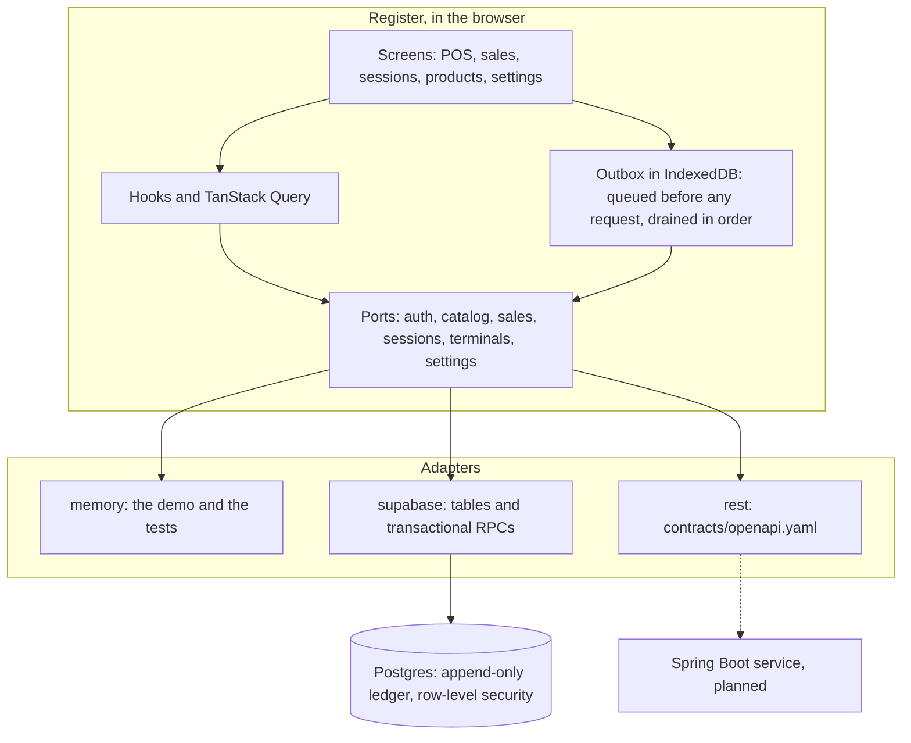

# POS Admin Dashboard

Point-of-sale screen and back-office dashboard for a cash register in a Tunisian shop. Cashiers sell from the POS screen; admins manage products, categories, register settings and the terminals.

> **Status:** this started as a Figma Make export and is now an offline-first register. Money is exact to the millime, the UI reaches its backend only through ports, sales go into an append-only ledger with per-terminal receipt numbers, cash sessions and Z-reports, and the register keeps selling with no network: records queue on the device and reach the server exactly once. Backends are swappable — an in-browser demo, Supabase, and a REST adapter written against [contracts/openapi.yaml](contracts/openapi.yaml) for the service that will implement it.

## Screenshots

| Login                    | Dashboard                | POS                      |
| ------------------------ | ------------------------ | ------------------------ |
| _Screenshot placeholder_ | _Screenshot placeholder_ | _Screenshot placeholder_ |

## Features

- Email and password login with two roles per shop: **admin** (dashboard) and **cashier** (POS only). There is no self-service sign-up.
- Products: create, edit, archive and search by name, category or barcode. Prices are entered in dinars with up to three decimals and stored as integer millimes. Stock only changes through recorded movements (opening stock, adjustments, sales, refunds).
- Categories with colour labels.
- Terminals: an admin registers each device as a terminal (`T1`, `T2`, …) in Settings.
- Cash sessions: the cashier opens a session with an opening float, sells, and closes it with the counted cash. Closing shows the Z-report: sales, refunds, net, totals per payment method, expected cash and the variance.
- Receipts numbered per terminal without gaps (`T1-1`, `T1-2`, …). A lost answer is retried with the same record, so it never costs a number and never records twice.
- Selling continues with no network. Every sale, refund and session change is queued on the device before any request is made, the receipt appears at once, and the queue drains in order when the connection returns. A sync chip shows what is still waiting, and a Conflicts screen shows anything the server refused.
- Refunds are new documents that point at the sale, per line and quantity, never above what is left. Sales and their lines can never be edited or deleted.
- Every amount is shown in Tunisian dinars with three decimals, for example `12,500 DT`.
- A credential-free demo backend that runs entirely in the browser.

## Stack

- React 18, TypeScript, Vite 6
- Tailwind CSS 4 and [shadcn/ui](https://ui.shadcn.com/) components on Radix UI, lucide-react icons, sonner toasts
- React Router 7, TanStack Query, react-hook-form with Zod
- Ports and adapters: an in-memory backend for tests and the demo, and a Supabase backend over tables with row-level security and transactional RPCs
- Supabase CLI for the local stack, pgTAP for database tests
- ESLint (typescript-eslint, react-hooks), Prettier, Vitest with Testing Library, MSW for the REST contract tests, Playwright for the offline end-to-end spec

## Architecture

The screens never speak to a backend. They call hooks, the hooks call ports, and one composition
root decides which adapter is behind them — so the same register runs on an in-browser demo, on
Supabase, or on a REST service, and the contract suite holds all three to the same answers.

Anything a terminal writes — a sale, a refund, opening or closing a session — goes into the outbox
on the device first, and only then towards a server.



A sale is written, numbered and shown from the device; the queue sends it once the network allows,
and the server accepts it exactly once. Receipt numbers stay gapless because the device allocates
them in the same transaction that queues the record and the server enforces the next one.

## Design decisions

The decisions worth arguing about, each with what it costs, are in [docs/adr](docs/adr):

| ADR                                                    | Decision                                                       |
| ------------------------------------------------------ | -------------------------------------------------------------- |
| [0001](docs/adr/0001-feature-folders.md)               | Feature folders, with ports, adapters and routes beside them   |
| [0002](docs/adr/0002-money-in-millimes.md)             | Money is an integer number of millimes, never a float          |
| [0003](docs/adr/0003-ports-and-adapters.md)            | The UI reaches a backend only through ports                    |
| [0004](docs/adr/0004-per-terminal-receipt-sequence.md) | Receipt numbers are allocated per terminal and stay gapless    |
| [0005](docs/adr/0005-offline-outbox.md)                | Records are queued on the device before any network call       |
| [0006](docs/adr/0006-append-only-ledger.md)            | Sales are never updated or deleted; a refund is a new document |

## Getting started

You need Node.js 22.13+ (22.x), 24.x or 26+.

### Demo, no credentials

```bash
npm install
npm run dev:demo
```

Open http://localhost:5173. The backend lives in the browser and starts empty again on every reload.

1. **Continue as Admin**, open **Settings** and register this device as terminal `T1`. Log out.
2. **Continue as Cashier**, open a session with an opening float, sell, refund from **Sales**, and close the session to see the Z-report.

A reload starts the whole device over: the backend, the queue and this device's terminal registration all go, because the demo clears them at boot rather than replay records into a shop that no longer exists. Repeat step 1 to register `T1` before selling again.

### Local Supabase

Needs Docker.

```bash
npm run db:start
npm run db:reset
```

`db:reset` applies `supabase/migrations/` and loads `supabase/seed.sql`: a demo shop with a dozen products, and a second shop the isolation tests use. Copy the API URL and anon key printed by `npx supabase status` into `.env`:

```bash
cp .env.example .env
npm run dev
```

| Account                    | Password             | Role                |
| -------------------------- | -------------------- | ------------------- |
| `admin@demo.local`         | `demo-admin-2026`    | admin, demo shop    |
| `cashier@demo.local`       | `demo-cashier-2026`  | cashier, demo shop  |
| `other-admin@demo.local`   | `other-admin-2026`   | admin, other shop   |
| `other-cashier@demo.local` | `other-cashier-2026` | cashier, other shop |

These accounts exist only in the local database.

### A hosted Supabase project

Never run migrations against a hosted project from a script in this repo. To move a project that still runs the original edge function, follow [docs/runbooks/kv-import.md](docs/runbooks/kv-import.md): apply the schema, create the shop and its members, dry-run the import and review the rejects, import, deploy, then delete the edge function.

## Environment variables

| Variable                 | Required        | Description                                                                               |
| ------------------------ | --------------- | ----------------------------------------------------------------------------------------- |
| `VITE_BACKEND`           | No              | Backend adapter: `memory`, `supabase` (default) or `rest`.                                |
| `VITE_SUPABASE_URL`      | With `supabase` | Supabase project URL, for example `https://<project-ref>.supabase.co`.                    |
| `VITE_SUPABASE_ANON_KEY` | With `supabase` | Supabase anon key. It is embedded in the browser bundle by design, so it is not a secret. |
| `VITE_API_BASE_URL`      | With `rest`     | Where the API of [contracts/openapi.yaml](contracts/openapi.yaml) is served.              |

Vite inlines these values at build time, so a change needs a rebuild. `.env.demo` sets `VITE_BACKEND=memory` for `npm run dev:demo`.

The contract and security tests against the local stack read these from the environment, never from `.env`:

| Variable                    | Description                                                                                        |
| --------------------------- | -------------------------------------------------------------------------------------------------- |
| `CONTRACT_BACKEND`          | Set to `supabase` to run the Supabase contract and security tests.                                 |
| `SUPABASE_URL`              | Local API URL from `npx supabase status`.                                                          |
| `SUPABASE_ANON_KEY`         | Local anon key.                                                                                    |
| `SUPABASE_SERVICE_ROLE_KEY` | Local service role key: re-reads rows and tries the writes nobody may make, in the security tests. |

## Scripts

| Command             | What it does                                                                  |
| ------------------- | ----------------------------------------------------------------------------- |
| `npm run dev`       | Start the dev server with the backend from `.env`.                            |
| `npm run dev:demo`  | Start the dev server with the in-memory demo backend.                         |
| `npm run build`     | Build for production into `dist/`.                                            |
| `npm run preview`   | Serve the production build locally.                                           |
| `npm run lint`      | Run ESLint (no warnings allowed) and Prettier check.                          |
| `npm run format`    | Format the codebase with Prettier.                                            |
| `npm run typecheck` | Type-check with `tsc --noEmit`.                                               |
| `npm test`          | Run the Vitest suite, including the contract suite on the memory backend.     |
| `npm run db:start`  | Start the local Supabase stack (Docker).                                      |
| `npm run db:stop`   | Stop it.                                                                      |
| `npm run db:reset`  | Re-create the local database from the migrations and the seed.                |
| `npm run db:test`   | Run the pgTAP tests in `supabase/tests/database`.                             |
| `npm run db:types`  | Regenerate `src/adapters/supabase/database.types.ts` from the local database. |

## Database

The schema lives in `supabase/migrations/`:

- **Shops and profiles.** Every member belongs to one shop with the role `admin` or `cashier`. Row-level security keeps each shop's rows to its own members.
- **Catalog.** Categories, products (archived rather than deleted) and append-only `stock_movements`; a product's stock is the sum of its movements.
- **Terminals and cash sessions.** A terminal keeps `last_seq` and a registration `epoch`; a terminal has at most one open session, and a closed session cannot change.
- **Sales ledger.** `sales` and `sale_lines` accept writes only through `record_sale`; nobody, including the service role, can update or delete them. Refunds are rows of kind `refund` with negative lines. `receipt_voids` lets an admin give up on a numbered record that can never be accepted, without leaving a gap.
- **Legacy import.** `migration.kv_import` reads the original key-value store, with a dry run and a list of rejects.

Every RPC raises the typed errors of [contracts/errors.md](contracts/errors.md); the app decides what to do from the code alone. RPC parameters and results use snake_case keys, and the adapter converts them to the camelCase of the ports.

## Roles

A member's role and shop come from `public.profiles`, never from token metadata. Add a member once their account exists, after confirming who owns it:

```sql
insert into public.profiles (user_id, shop_id, role, display_name)
select u.id, '<shop-id>', 'cashier', '<name>' from auth.users u where u.id = '<user-id>'
returning user_id;
```

A role change applies to the member's next request; the app shows it after they log out and back in.

## Delivery

### Run it in a container

A multi-stage build compiles the app with Node and hands `dist/` to nginx, so the image carries no Node runtime and no source. It listens on 8080 as an unprivileged user and answers `/healthz`.

```bash
docker compose up --build
```

Open http://localhost:8080. Compose publishes to `127.0.0.1:8080` and nothing else: the register needs a secure context for the Web Crypto API, Web Locks and the service worker, and `localhost` is one. To reach it from another device on the shop network, put it behind TLS rather than publishing plain HTTP.

The image defaults to the credential-free demo. Vite inlines its configuration at build time, so another backend is another image:

```bash
docker build \
  --build-arg VITE_BACKEND=supabase \
  --build-arg VITE_SUPABASE_URL=https://<project-ref>.supabase.co \
  --build-arg VITE_SUPABASE_ANON_KEY=<anon-key> \
  -t pos-admin-dashboard .
```

Nothing comes from `.env`: `.dockerignore` keeps it out of the build context, along with the host's `node_modules`, which are built for the wrong platform.

`index.html` and `sw.js` are served with `no-cache`, so a release is picked up on the next visit and a browser never holds an old service worker. `/assets/` is immutable, because those file names change whenever their contents do. Every other path falls back to the app shell.

`.github/workflows/ci.yml` runs lint, typecheck, the Vitest suite and a build on every push, the Playwright offline-selling spec after it, and — only on pull requests to `main` — the pgTAP tests and the port contract suite against a local Supabase stack.

### Deploy it to a static host

`netlify.toml` deploys the public demo to **Netlify**. The build command, the publish directory, the single-page fallback and the same cache and security headers as nginx are all in that one committed file, so nothing about the deployment is hidden in a dashboard. It holds no secrets: the site it builds is the in-browser backend.

The app is static files, so any host that can serve `dist/` works. Whatever you use needs the three rules above: the fallback to `index.html`, long caching for `/assets/` only, and revalidation for `index.html` and `sw.js`.

### The two demos

| Demo          | Who can open it             | What is behind it                                                       |
| ------------- | --------------------------- | ----------------------------------------------------------------------- |
| Public demo   | Anyone, with no credentials | The in-memory backend, in the visitor's own browser. Nothing is shared. |
| Supabase demo | Whoever has the demo login  | A real shop in a hosted project, reset every night.                     |

The **public demo** is what `VITE_BACKEND=memory` builds, and what the container image and the Netlify site serve by default. Each visitor gets their own backend, starting empty; a reload empties it again. There is no account to create, no server to reach and nothing anyone can break for anyone else.

The **Supabase demo** is a real shop in a hosted project, published with a cashier and an admin login so the ledger, the Z-reports and the sync behaviour can be seen against a real database. Because the sales ledger is append-only — nobody, not even the service role, can update or delete a row — a demo shop needs a way back to its starting state. `private.reset_demo_shop` is it: it removes the trading history of the shop's closed sessions and recomputes stock from the movements that are left. It keeps the open session and everything in it, any sale a kept refund points at, and the terminals' `last_seq`, so receipt numbering never repeats. It is the only path allowed to delete ledger rows, and it refuses any shop not listed in `private.demo_shops`.

To schedule it, run `supabase/scripts/schedule_demo_reset.sql` once in the SQL editor of the demo project, with the demo shop's id filled in. It needs the `pg_cron` extension, and it belongs on a demo project only — never on a shop's real project. `supabase/tests/database/03_demo_reset.test.sql` covers what the reset keeps, what it removes, and that the same deletes are still refused outside it.

## Before and after

Measured against the Figma Make export this started from (`d3cdb2c`, recorded in
[docs/baseline.md](docs/baseline.md)):

|                          | Export                                                   | Now                                                                   |
| ------------------------ | -------------------------------------------------------- | --------------------------------------------------------------------- |
| Direct dependencies      | 55                                                       | 19                                                                    |
| Dev dependencies         | 4                                                        | 22                                                                    |
| Largest JavaScript chunk | 634 kB, one chunk                                        | 143 kB, six chunks                                                    |
| Tests                    | none                                                     | 1136 unit and page tests, 2 Playwright specs, 130 database assertions |
| Lint and types           | neither; `typescript` not installed                      | ESLint with no warnings allowed, `tsc` strict                         |
| Money                    | floats, shown as `$12.50`                                | integer millimes, shown as `12,500 DT`                                |
| Recording a sale         | two requests against a key-value store anyone could edit | one transactional RPC into an append-only ledger                      |
| Selling offline          | not possible                                             | queued on the device, sent exactly once                               |
| Lighthouse failures      | favicon 404, no meta description, no robots.txt          | all three fixed                                                       |

Two numbers went the other way, on purpose. `node_modules` grew from 188 MB to 376 MB, and dev
dependencies from 4 to 22: that is the test and delivery tooling — Vitest, Testing Library, MSW,
Playwright, the Supabase CLI — none of which ships to a browser. What does ship got smaller.

## Roadmap

- **A Spring Boot service implementing [contracts/openapi.yaml](contracts/openapi.yaml).** The REST
  adapter and its contract tests already exist, so the service can be built against them and the
  register switched over with one environment variable.
- **ESC/POS receipt printing**, so a receipt leaves the register on paper rather than a screen.
- **Barcode-wedge input**, so a scanner that types can drive the POS without touching the search box.

## Known issues

- **A record the server refuses stops this device's queue.** Later records wait behind it until a person retries it or voids it on the Conflicts screen. That is deliberate — nothing may reach the ledger out of order — but it needs someone to look.
- **A hosted project may still run the original edge function.** Its code is gone from this repo, but a deployed copy keeps its service role access, which bypasses row-level security, until you delete it ([runbook](docs/runbooks/kv-import.md), step 7).

## Credits

UI components come from [shadcn/ui](https://ui.shadcn.com/), used under the [MIT license](https://github.com/shadcn-ui/ui/blob/main/LICENSE.md).
